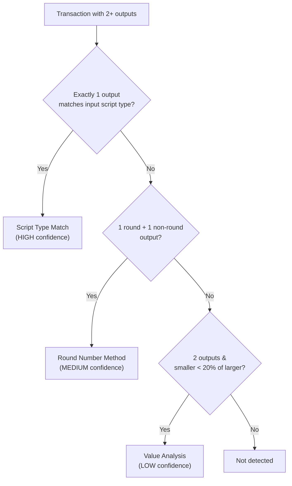
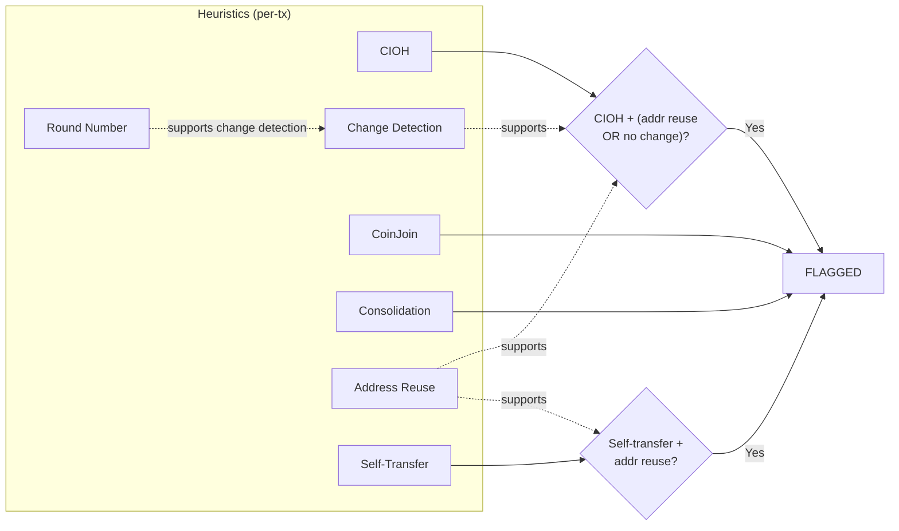
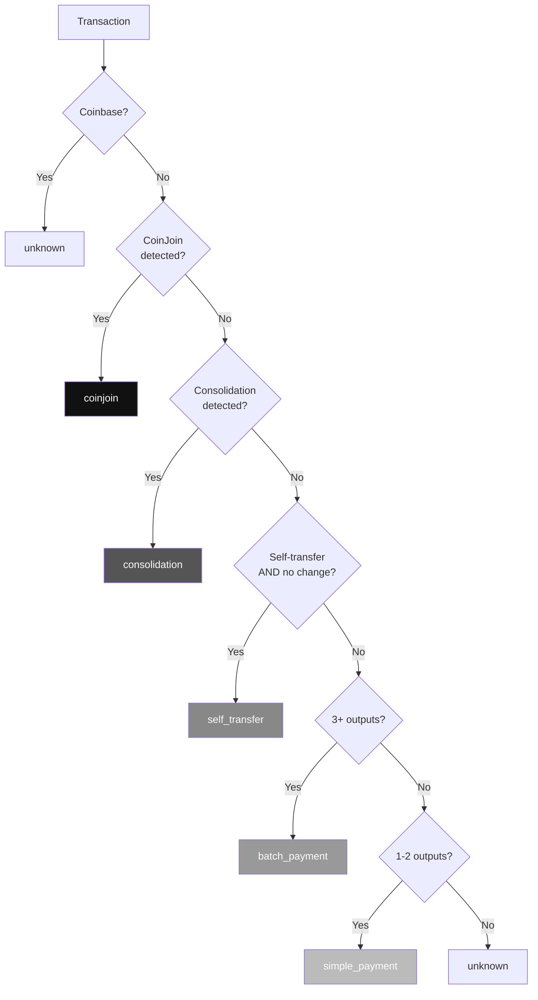
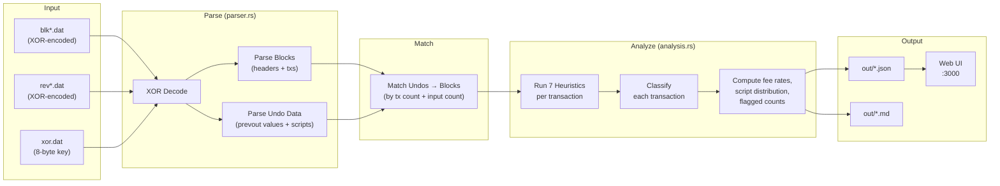

# Approach

## Table of Contents

- [Heuristics Implemented](#heuristics-implemented)
- [Flagging Logic](#flagging-logic)
- [Transaction Classification](#transaction-classification)
- [Architecture Overview](#architecture-overview)
- [Data Flow Pipeline](#data-flow-pipeline)
- [Trade-offs and Design Decisions](#trade-offs-and-design-decisions)
- [Testing Strategy](#testing-strategy)
- [Performance](#performance)
- [Privacy Implications](#privacy-implications)
- [References](#references)

---

## Heuristics Implemented

Each heuristic is independent and produces a binary `detected: bool` result. Classification then combines these signals with a priority ordering. Coinbase transactions are always excluded from all heuristics.

### 1. Common Input Ownership Heuristic (CIOH)

**What it detects:**
Transactions where multiple inputs are spent together, implying all inputs are controlled by the same entity/wallet.

**How it is detected/computed:**
Flag any transaction with more than one input. This is the foundational assumption in chain analysis — if a transaction requires signing multiple inputs, those inputs are most likely held by the same wallet.

**Confidence model:**
High confidence for standard wallets. The heuristic is binary: detected if `inputs.len() > 1`.

**Limitations:**
- CoinJoin transactions deliberately violate this assumption — multiple independent parties contribute inputs.
- PayJoin (P2EP) transactions also combine inputs from sender and recipient.
- Lightning channel opens with dual funding may have inputs from different parties.

> **Note:** When CoinJoin is detected, CIOH is automatically disabled for that transaction to avoid false attribution.

---

### 2. Change Detection

**What it detects:**
Identifies which output in a transaction is likely the "change" returned to the sender's wallet.

**How it is detected/computed:**
Three methods applied in priority order:



1. **Script type matching (high confidence):** If exactly one output matches the dominant input script type (from undo data), it's likely change. Wallets typically send change to the same address type.
2. **Round number analysis (medium confidence):** If one output is a round BTC amount and only one output is non-round, the non-round output is likely change (payments tend to be round amounts).
3. **Value analysis (low confidence):** For 2-output transactions, if the smaller output is less than 20% of the larger and neither is a round number, the smaller is heuristically treated as change.

**Confidence model:**
- `high`: Script type match (single matching output).
- `medium`: Round number differentiation.
- `low`: Value-based guess for 2-output transactions.

**Limitations:**
- Wallets that randomize output ordering defeat the value heuristic.
- Payments can be non-round amounts, causing false positives.
- When both outputs are the same script type, script type matching cannot distinguish change from payment.

---

### 3. CoinJoin Detection

**What it detects:**
CoinJoin transactions where multiple participants combine inputs and create equal-value outputs to obscure the transaction graph.

**How it is detected/computed:**
A transaction is flagged as CoinJoin if:
- It has at least 3 inputs AND at least 3 outputs.
- There exist at least 3 outputs with identical values (equal-value denomination).
- The number of inputs is at least as large as the number of equal-value outputs.

**Confidence model:**
Medium-high confidence. The equal-output-value pattern is distinctive. The threshold of 3 equal outputs reduces false positives from coincidental value matches.

**Limitations:**
- PayJoin and batched payments with coincidentally equal amounts may trigger false positives.
- Non-equal-output CoinJoin protocols (like Knapsack mixing) won't be detected.
- Transactions with change outputs from CoinJoin may not have perfectly equal counts.

---

### 4. Consolidation Detection

**What it detects:**
Wallet consolidation transactions where many UTXOs are combined into 1–2 outputs, typically for UTXO management.

**How it is detected/computed:**
A transaction is flagged as consolidation if:
- It has 3 or more inputs.
- It has at most 2 outputs.
- Either all inputs and outputs share the same script type, or there is exactly 1 output.
- When undo data is unavailable, falls back to input/output count ratio alone.

**Confidence model:**
High confidence when script types match across all inputs and outputs. Medium confidence with single output (could also be a sweep).

**Limitations:**
- Large exchange withdrawals may look similar.
- Sweep transactions (moving all funds to a new wallet) are indistinguishable.

---

### 5. Round Number Payment Detection

**What it detects:**
Outputs with round BTC amounts (multiples of 0.001 BTC / 100,000 satoshis), which are more likely to be intentional payments rather than change.

**How it is detected/computed:**
Each output value is checked against multiple round thresholds: multiples of 1 BTC, 0.1 BTC, 0.01 BTC, 0.001 BTC, 0.0001 BTC, or 0.00001 BTC (1000 sats). Detected if any output satisfies this condition. Used as a support signal for change detection rather than a standalone flag.

**Confidence model:**
Medium confidence. Round amounts are a weak but useful signal for distinguishing payments from change.

**Limitations:**
- Change can coincidentally be a round number.
- Some users specify exact satoshi amounts for payments.
- Very small round amounts (e.g., 100,000 sats) are less meaningful than larger ones.

---

### 6. Address Reuse Detection

**What it detects:**
When the same address (script) appears in both the inputs and outputs of a transaction, weakening privacy by linking the sender to a specific output.

**How it is detected/computed:**
Compare raw scriptPubKey bytes from undo data (input prevouts) against all output scriptPubKeys, filtering to wallet script types only (P2PKH, P2WPKH, P2TR). Empty scripts and OP_RETURN outputs are excluded. P2SH and P2WSH are excluded because reuse in those types typically reflects exchange/contract infrastructure where reuse is intentional, not a privacy mistake. If any filtered input script matches a filtered output script, the address is being reused within the same transaction.

**Confidence model:**
High confidence — byte-level script comparison is exact.

**Limitations:**
- Only detects intra-transaction reuse, not cross-transaction reuse within a block (would require additional tracking).
- Some wallets intentionally reuse addresses (e.g., donation addresses).
- Excludes P2SH/P2WSH reuse which may occasionally represent real privacy issues in non-infrastructure contexts.

---

### 7. Self-Transfer Detection

**What it detects:**
Transactions where all outputs appear to belong to the same entity as the inputs — no obvious "payment" to an external party.

**How it is detected/computed:**
Flagged when:
- All output script types match the dominant input script type.
- The transaction has at most 2 outputs.
- Additionally requires address reuse detected OR a single output — to avoid false positives on normal payments where sender and recipient happen to use the same script type.

**Confidence model:**
Medium confidence. Matching script types combined with address reuse provides a stronger signal than type matching alone.

**Limitations:**
- Self-transfers between different address types won't be detected.
- Single-output transactions to an external party with the same script type may be incorrectly flagged.

---

## Flagging Logic

Not every heuristic detection results in a transaction being "flagged." The flagging logic combines heuristic signals to reduce false positives:



| Condition | Why it's flagged |
|---|---|
| **CoinJoin detected** | Always suspicious — deliberate privacy mixing |
| **Consolidation detected** | Reveals wallet UTXO management patterns |
| **CIOH + (address reuse OR no change output)** | Multiple inputs from same entity + additional evidence of single-entity control |
| **Self-transfer + address reuse** | Same wallet recycling addresses, confirmed by reuse |

Heuristics like `round_number_payment` and `change_detection` alone do **not** flag a transaction — they serve as supporting evidence for other flags.

---

## Transaction Classification

Each non-coinbase transaction is assigned exactly one classification using the following priority:



Priority order ensures the most specific classification wins. For example, a transaction with 5 inputs and 5 equal outputs is classified as `coinjoin` even though it also satisfies `consolidation` criteria.

---

## Architecture Overview

The solution is implemented entirely in Rust for performance, with a single-page HTML/JS web UI served by a built-in HTTP server.

### Code Structure

```
src/
├── main.rs        # CLI entry point: file I/O, block/undo parsing, orchestration
├── parser.rs      # Binary parser: XOR decode, block headers, transactions, undo data
├── analysis.rs    # Heuristic engine: 7 heuristics + transaction classification
├── output.rs      # JSON schema builder + Markdown report generator
└── bin/
    └── web.rs     # HTTP server with inline SPA for the web visualizer
```

### Module Responsibilities

| Module | Responsibility | Lines |
|---|---|---|
| `parser.rs` | XOR decode, varint, block/tx/undo parsing, script classification | ~700 |
| `analysis.rs` | 7 heuristics, classification, block-level analysis | ~560 |
| `output.rs` | JSON schema construction, Markdown report generation | ~300 |
| `main.rs` | CLI argument handling, file I/O, undo matching | ~200 |
| `web.rs` | TCP server, API routes, inline HTML/CSS/JS SPA | ~700 |

---

## Data Flow Pipeline



### Detailed Parse Steps

1. **Read & decode**: `blk*.dat` and `rev*.dat` are XOR-decoded using the 8-byte key from `xor.dat`.
2. **Parse blocks**: 80-byte headers (version, prev_hash, merkle_root, timestamp, bits, nonce), varint-delimited transactions with full SegWit support (marker/flag detection, witness data).
3. **Parse undo data**: Bitcoin Core's compressed format — MSB-continuation VARINT for height/coinbase encoding, compressed amounts (`CTxOutCompressor`), compressed scripts (P2PKH/P2SH/P2PK special cases + raw fallback).
4. **Match undos to blocks**: By non-coinbase transaction count + input count verification.
5. **Analyze**: Each transaction is run through all 7 heuristics, classified, and fee rates computed from undo prevout values.
6. **Output**: JSON (full transactions for `blocks[0]`, summary only for rest) and Markdown reports written to `out/`.

### Key Technical Details

- **Bitcoin Core VARINT**: Two different varint encodings — CompactSize (0xFD/FE/FF prefix) for counts/lengths and MSB-continuation VARINT for heights/amounts in undo data. The undo data includes a dummy version byte when height > 0 (backward compatibility).
- **Script classification**: Outputs are classified into P2PKH, P2SH, P2WPKH, P2WSH, P2TR, P2PK, OP_RETURN, or unknown based on scriptPubKey byte patterns.
- **Fee calculation**: `fee = sum(input_values) - sum(output_values)`, using prevout values from undo data. Fee rate = `fee / vsize` where `vsize = ceil(weight / 4)`, matching Bitcoin Core's virtual size calculation.
- **Weight computation**: `weight = non_witness_size * 4 + witness_size * 1` per BIP 141.

---

## Trade-offs and Design Decisions

### Accuracy vs. Performance

| Decision | Trade-off |
|---|---|
| Single-pass analysis | Each tx analyzed once (O(n)) rather than multi-pass graph analysis |
| Per-block heuristics | No cross-block entity linking — faster but misses inter-block patterns |
| Conservative thresholds | CoinJoin needs 3+ equal outputs, consolidation needs 3+ inputs — fewer false positives but misses edge cases |

### Simplicity vs. Coverage

| Decision | Rationale |
|---|---|
| No UTXO graph construction | Would enable peeling chain detection but adds significant memory/complexity |
| Script type matching over address derivation | Byte-level comparison avoids the need for full address encoding (bech32, base58) |
| First-block-only transactions in JSON | Keeps output size manageable for grader; per-block summaries still include all blocks |

### Other Decisions

- **Rust for everything**: Chose Rust for both CLI and web server to avoid polyglot complexity. Parsing 130MB of block files in ~2 seconds. No external HTTP framework — using `std::net::TcpListener` for minimal dependencies.
- **Inline web UI**: The entire SPA (HTML + CSS + JS) is embedded as a Rust string constant. No build step, no npm, no bundler — just `cargo build`.
- **Undo data matching**: Blocks in `blk*.dat` and `rev*.dat` may not be in the same order. We match by comparing non-coinbase transaction counts and verifying input counts for the first few transactions.
- **Change detection priority**: Script type matching > round number analysis > value analysis, reflecting decreasing reliability.

---

## Testing Strategy

79 unit tests covering both parser and analysis logic:

### Parser Tests (37 tests)
- **XOR encoding**: Roundtrip, empty key identity, empty data
- **Varint encoding**: All 4 CompactSize formats (1/2/4/8 byte), boundary values, push/size helpers
- **Bitcoin Core VARINT**: MSB-continuation format (0, single-byte, multi-byte)
- **Script classification**: All 8 types (P2PKH, P2SH, P2WPKH, P2WSH, P2TR, OP_RETURN, P2PK, unknown)
- **BIP34 height**: 1-byte, 3-byte, empty, zero, overflow
- **Block parsing**: Empty data, bad magic number
- **Compressed amounts**: Zero, non-zero decompression

### Analysis Tests (42 tests)
- **Each heuristic**: Positive and negative cases
- **Address reuse**: Filtering of non-wallet script types (P2SH/P2WSH excluded)
- **Classification priority**: Coinjoin > consolidation > self-transfer > batch > simple
- **Edge cases**: CoinJoin disabling CIOH, self-transfer with/without change
- **Full block analysis**: Empty block, coinbase-only, coinjoin+CIOH interaction

```
cargo test  →  79 passed, 0 failed
```

---

## Performance

| Metric | blk04330 (84 blocks) | blk05051 (78 blocks) |
|---|---|---|
| Transactions | 341,792 | 256,523 |
| Parse + Analyze | ~2s | ~1.5s |
| JSON output | 2.9 MB | 2.5 MB |
| Flagged | 49,955 (14.6%) | 50,738 (19.8%) |

"Flagged" means the transaction triggered a suspicious combination of heuristics (see [Flagging Logic](#flagging-logic)) — not just any single heuristic firing. The 14–20% range is expected: consolidation and CIOH-with-address-reuse account for the majority, while CoinJoin contributes a small but significant fraction. The higher rate in blk05051 reflects its lower-fee-period blocks which contain more consolidation transactions (wallet maintenance during cheap fee windows).

Memory usage stays under 500 MB — the entire block file is loaded into memory, decoded, and parsed in a single pass without streaming.

---

## Privacy Implications

Chain analysis is a double-edged sword. This tool demonstrates how probabilistic heuristics can de-anonymize Bitcoin transactions:

| Heuristic | Privacy Impact |
|---|---|
| CIOH | Links multiple UTXOs to one wallet |
| Change Detection | Reveals which output returns to the sender |
| Address Reuse | Directly links transactions to the same entity |
| Self-Transfer | Identifies internal wallet movements |
| CoinJoin Detection | Identifies (and potentially defeats) privacy-enhancing transactions |

Users who care about privacy should: use CoinJoin, avoid address reuse, use different script types for change outputs, and avoid round-number payments. The effectiveness of these countermeasures against production chain analysis tools is an active area of research.

---

## References

### Bitcoin Protocol
- [Bitcoin Developer Reference — Block Chain](https://developer.bitcoin.org/reference/block_chain.html)
- [BIP 34 — Block v2, Height in Coinbase](https://github.com/bitcoin/bips/blob/master/bip-0034.mediawiki)
- [BIP 141 — Segregated Witness](https://github.com/bitcoin/bips/blob/master/bip-0141.mediawiki)

### Bitcoin Core Internals
- [Bitcoin Core serialize.h — VARINT encoding](https://github.com/bitcoin/bitcoin/blob/master/src/serialize.h)
- [Bitcoin Core compressor.h — Script/Amount compression](https://github.com/bitcoin/bitcoin/blob/master/src/compressor.h)
- [Bitcoin Core undo.h — Block undo data format](https://github.com/bitcoin/bitcoin/blob/master/src/undo.h)
- [Bitcoin Core v28 XOR obfuscation PR #28052](https://github.com/bitcoin/bitcoin/pull/28052)

### Chain Analysis Research
- [Meiklejohn et al. "A Fistful of Bitcoins" (2013)](https://cseweb.ucsd.edu/~smeiklejohn/files/imc13.pdf) — foundational chain analysis paper establishing CIOH and clustering
- [Nick, J. "Data-Driven De-Anonymization in Bitcoin" (2015)](https://jonasnick.github.io/blog/2015/02/12/data-driven-de-anonymization-in-bitcoin/) — change detection heuristics
- [Bitcoin Wiki — Common Input Ownership Heuristic](https://en.bitcoin.it/wiki/Common-input-ownership_heuristic)
- [Ermilov et al. "Automatic Bitcoin Address Clustering" (2017)](https://ieeexplore.ieee.org/document/8029471) — multi-heuristic clustering approaches
